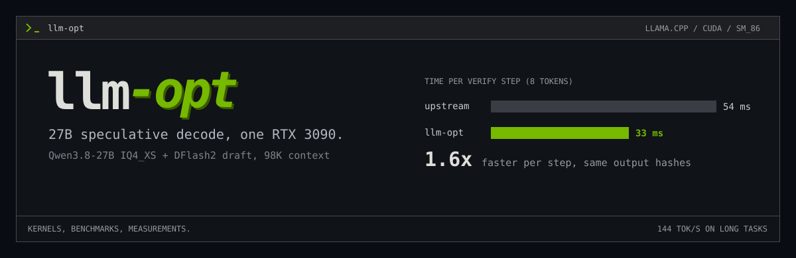
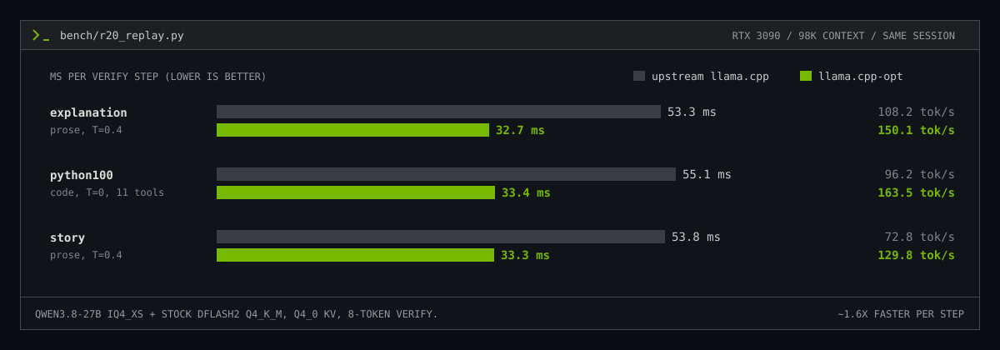

<p align="center">
  
</p>

<p align="center">
  <strong>Making a 27B model decode fast on one consumer GPU.</strong><br>
  Kernels, benchmarks and measurements for llama.cpp speculative decoding on an RTX 3090.
</p>

<p align="center">
  <code>RTX 3090 / SM_86</code> &nbsp; <code>QWEN3.8-27B + DFLASH2</code> &nbsp; <code>BIT-EXACT KERNEL CHANGES</code> &nbsp; <a href="LICENSE">MIT</a>
</p>

<p align="center">
  <a href="#results">Results</a> &middot; <a href="#model">Model</a> &middot; <a href="#what-changed">What changed</a> &middot; <a href="docs/STATUS.md">Status</a> &middot; <a href="docs/design/experiments.md">Experiments</a> &middot; <a href="docs/DEPLOYMENT.md">Test and ship</a> &middot; <a href="https://github.com/invaliddayta/llama.cpp-opt">The fork</a>
</p>

Qwen3.8-27B (IQ4_XS, hybrid Gated-DeltaNet/attention) drafts with DFlash2 and verifies 8 tokens
per step. On one RTX 3090 over USB4, stock llama.cpp spends about 54 ms per verify step. Here it
takes 33 ms, with the same output.

The code changes live in the fork **[llama.cpp-opt](https://github.com/invaliddayta/llama.cpp-opt)**.
This repo is the workbench around it: labs that check a kernel against production before it gets
near a server, replay benchmarks that hash outputs, profiling scripts, and notes on what worked
and what didn't.

## Results



Three long tasks replayed as direct requests (`bench/r20_replay.py`), upstream and fork built
from the same base and run back to back with the same model files, flags and sampling:

| Task | Sampling | upstream `8df332de1` | llama.cpp-opt | per step |
| --- | --- | --- | --- | --- |
| explanation (~1200-word prose) | T=0.4, top-p 0.95, top-k 20, seed 1234 | 53.3 ms, 108.2 tok/s | **32.7 ms, 150.1 tok/s** | -39% |
| python100 (CLI program, 11 tools attached) | T=0 | 55.1 ms, 96.2 tok/s | **33.4 ms, 163.5 tok/s** | -39% |
| story (~1500 words) | T=0.4, top-p 0.95, top-k 20, seed 1234 | 53.8 ms, 72.8 tok/s | **33.3 ms, 129.8 tok/s** | -38% |
| weighted | | 90.5 tok/s | **143.7 tok/s** | |

Compare ms per verify step: about 1.6x faster. tok/s also depends on
how many drafted tokens are accepted per step (3.9-5.8 here), which depends on the text.
Upstream samples with a different RNG, so its outputs and lengths differ from the fork's, and
its tok/s is only indicative. Every fork change since 2026-10-04 keeps the output
bit-identical, checked by output hashes. More tables (plain chat, agent turns, long context):
[docs/STATUS.md](docs/STATUS.md).

Where the 33 ms go: ~20 ms quantized matmuls streaming weights at 750-830 GB/s (of ~840 GB/s),
~8 ms of smaller target ops, ~4 ms draft, under 1 ms host. Breakdown and next candidates:
[docs/design/experiments.md](docs/design/experiments.md).

## Model

All numbers use these exact files (pinned Hugging Face revisions):

| Role | Hugging Face repo @ revision | File | Quant | Size | SHA-256 |
| --- | --- | --- | --- | --- | --- |
| Target | [HauhauCS/Qwen3.8-27B-Uncensored-HauhauCS-Aggressive-MTP-GGUF](https://huggingface.co/HauhauCS/Qwen3.8-27B-Uncensored-HauhauCS-Aggressive-MTP-GGUF) @ `993a5971` | `Qwen3.8-27B-Uncensored-HauhauCS-Aggressive-IQ4_XS.gguf` | IQ4_XS (4.25 bpw) | 15.7 GB | `034b4c6b...9f9bd0b0` |
| Draft | [z-lab/Qwen3.8-27B-DFlash2-GGUF](https://huggingface.co/z-lab/Qwen3.8-27B-DFlash2-GGUF) @ `2d9571f8` | `Qwen3.8-27B-DFlash2-Q4_K_M.gguf` | Q4_K_M | 1.14 GB | `1a25c568...db131ebd` |
| Vision projector | target repo @ `993a5971` | `mmproj-Qwen3.8-27B-Uncensored-HauhauCS-Aggressive-BF16.gguf` | BF16 | 0.93 GB | `5681b690...de2dd142` |

<details>
<summary>Full SHA-256 and revisions</summary>

```text
target  034b4c6b7c5cd9f4a2f99570d5097698f9d1e265a0fb000207223cbf9f9bd0b0  rev 993a5971fda8f30dd1b7eb2654792ba4415c7460
draft   1a25c56858e1ebe93f2718ac1d49d1151f9323325c1bbfd6209370f4db131ebd  rev 2d9571f8ce46e151f61c6499c99dee6079e1d610
mmproj  5681b690bcb8eb10cd28d62d078cb4e01521a3ea4880a3fc7d54de72de2dd142  rev 993a5971fda8f30dd1b7eb2654792ba4415c7460
```

</details>

- **Target:** Qwen3.8-27B, a hybrid model with 64 layers: 48 Gated-DeltaNet (linear attention,
  fixed-size recurrent state) and 16 full-attention layers (24 query / 4 KV heads, head size
  256). Vocabulary 248,320. The GGUF also embeds an MTP head, which is not used here.
- **Draft:** z-lab's stock **DFlash2** block drafter (5 layers, conditioned on five target
  layers' hidden states), `--spec-type draft-dflash`, up to 7 drafted tokens per step, so 8
  tokens are verified per step. **No custom-trained drafter is used.** `drafter/` holds an
  unfinished fine-tuning experiment.
- **Context and KV compression:** 98,304 tokens. The target's KV cache is quantized to
  **q4_0 for both K and V** (4.5 bits per value instead of 16 for f16, 3.6x smaller): 1.7 GiB
  instead of 6 GiB at full context, and only the 16 attention layers need it. The draft's KV
  cache stays f16. The Gated-DeltaNet layers keep their fixed-size f32 recurrent state.
- **Server:** single slot, flash attention on, batch 2048 / ubatch 512, thinking on.

## What changed

| | Change | Effect |
| --- | --- | --- |
| **MMSQ** | Small-batch (N <= 16) quantized GEMM on int8 tensor cores for IQ4_XS, Q4_K, Q5_K, Q6_K, with split-K and activation reuse | Verify steps are bound by weight bandwidth; most of the gain |
| **Fused norm** | Residual add + RMS norm + weight + activation quantization in one kernel | 127 fewer kernels per step, bit-exact |
| **Q4 attention** | q4_0 KV decoded straight into the MMA flash-attention tiles | 95.8 -> 109.7 tok/s at 91K context ([notes](docs/design/q4-mma-attention.md)) |
| **GPU grammar** | Tool-call grammar compiled to a DFA, masked and sampled on the GPU | No 7.9 MB logits copy per step on tool requests ([notes](docs/design/gpu-grammar.md)) |
| **DFlash features** | Draft conditioning features stay on the GPU | No host round trip per step ([notes](docs/design/gpu-feature-bridge.md)) |
| **Small kernels** | Small top-k, conv-state snapshot fusion, small F32 matmul | Fewer, cheaper launches |
| **Sleep cache** | KV/state snapshot to disk on idle unload, restored on wake | Long contexts survive idle sleep |
| **Race fix** | Shared-memory race in `flash_attn_ext_vec` (upstream bug) | racecheck 2.2M hazards -> 0 |

Tried and dropped (no gain): split CUDA graph launches, skipping GDN state snapshots, GPU token
embedding, deeper MMSQ pipelines. Numbers in [experiments.md](docs/design/experiments.md#dropped).

## Try it

You need an sm_86 GPU with 24 GB, CUDA 12.x, the target and DFlash2 draft GGUFs (the mmproj is
optional) and a chat template. Nix users get the toolchain from `nix develop`.

```sh
git clone https://github.com/invaliddayta/llm-opt && cd llm-opt
git clone -b opt/main https://github.com/invaliddayta/llama.cpp-opt llama.cpp
nix develop
cmake -S llama.cpp -B llama.cpp/build -G Ninja -DGGML_CUDA=ON -DCMAKE_CUDA_ARCHITECTURES=86 \
      -DCMAKE_BUILD_TYPE=Release -DLLAMA_BUILD_TESTS=ON
ninja -C llama.cpp/build llama-server test-backend-ops
```

Start a server with the production flags and replay the benchmark tasks:

```sh
GGML_CUDA_FATTN_Q4_MMA=1 LLAMA_GPU_SAMPLING=1 LLAMA_DFLASH_GPU_FEATURES=1 \
  MODEL=... DRAFT=... TEMPLATE=... bench/serve_test.sh    # port 8181; MMPROJ=... optional
python3 bench/r20_replay.py --url http://127.0.0.1:8181   # ms/step, tok/s, output hashes
```

The three opt-ins are off by default; MMSQ is on. Other GPUs, models and batch shapes fall back
to upstream code paths. Switches and the full test workflow: [docs/DEPLOYMENT.md](docs/DEPLOYMENT.md).

## Inside

| Path | What |
| --- | --- |
| `kernels/lab_all.cu` | MMSQ lab on the fork's real header: correctness, bandwidth, whole-output exactness vs production |
| `kernels/mmsq_exact_sweep.sh` | Sweeps launch knobs that cannot change the result (stages, CTAs/SM) |
| `kernels/bw_probe.cu`, `kernels/gdn_replay_lab.cu` | DRAM read ceiling; GDN snapshot vs replay |
| `bench/r20_replay.py` | The task replay above |
| `bench/ab_bins.sh`, `bench/ab_replay.sh` | Interleaved A/B of two builds, or of flags |
| `bench/profile_decode.sh`, `bench/analyze_nsys.py` | nsys trace of a decode and its kernel/idle breakdown |
| `bench/compat_check.py` | Request compatibility: penalties, logprobs, JSON schema, tools, image |
| `bench/bench.py`, `bench/agent_bench.py`, `bench/opencode_client_bench.py` | Plain chat, agent turns with a tool catalog, real OpenCode tasks |
| `drafter/`, `eval/` | Unfinished DFlash2 fine-tuning pipeline (not used for any result), KL-divergence evaluation |
| `docs/` | Status, test/ship workflow, design notes |

Ignored and local: `llama.cpp/` (the fork checkout), `models/`, `data/`, `runs/`, `.venv/`, and
`driver-libs/` (host NVIDIA user-space libraries matching the kernel driver; may be a symlink).

## How changes get in

1. The kernel lab in `kernels/`: the change has to beat production and match it bit for bit
   (`EXACT_BASELINE=1`) on the real shapes.
2. `test-backend-ops` for each touched op, compute-sanitizer for races.
3. Replay A/B of the old and new build, back to back. Output hashes must match and ms/step must drop.
4. Ship as one patch against upstream, rebuild, check against the live server.

## License

[MIT](LICENSE). The fork keeps llama.cpp's MIT license. Not affiliated with ggml-org, Qwen or
z-lab.
